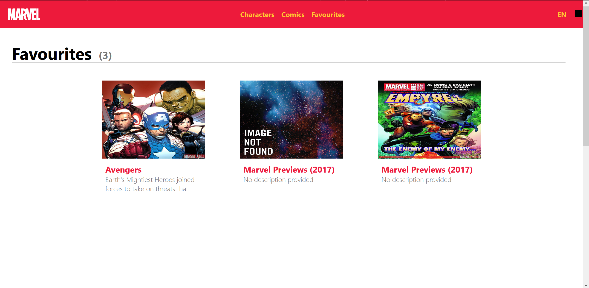
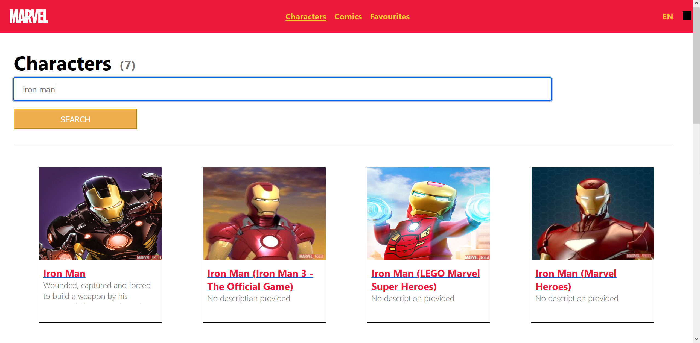

# Marvel Characters Information

## Описание

Приложение создано для удобного поиска и просмотра персонажей и комиксов Marvel.

В нем вы можете найти любимого персонажа и посмотреть всю информацию о нем: имя, описание и даже комиксы в которых персонаж учавствовал.

Если вам понравился персонаж или комикс вы можете добавить его в избранное, чтобы не забыть о нем!

## Технологии

- React, TypeScript, CSS, HTML

- Marvel API: https://developer.marvel.com/

## Запуск приложения

1. Клонируйте репозиторий.
```bash
git clone https://github.com/RiverSpider/web-course.git
```
2. Откройте проект в вашей IDE.
3. Откройте директорию с проектом.
```bash
cd react-ts-template
```
4. Убедитесь, что у вас установлены все необходимые зависимости.
```bash
npm install
```
5. Запустите локальный хост.
```bash
npm run dev
```

## Деплой

Приложение доступно по ссылке:

https://web-course-deploy.vercel.app/

## Скриншоты






## Автор

# Автор: Раевских Максим Игоревич
